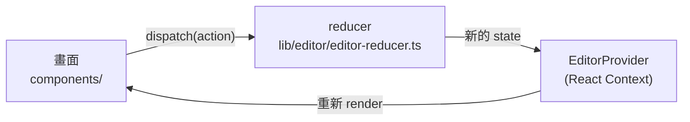
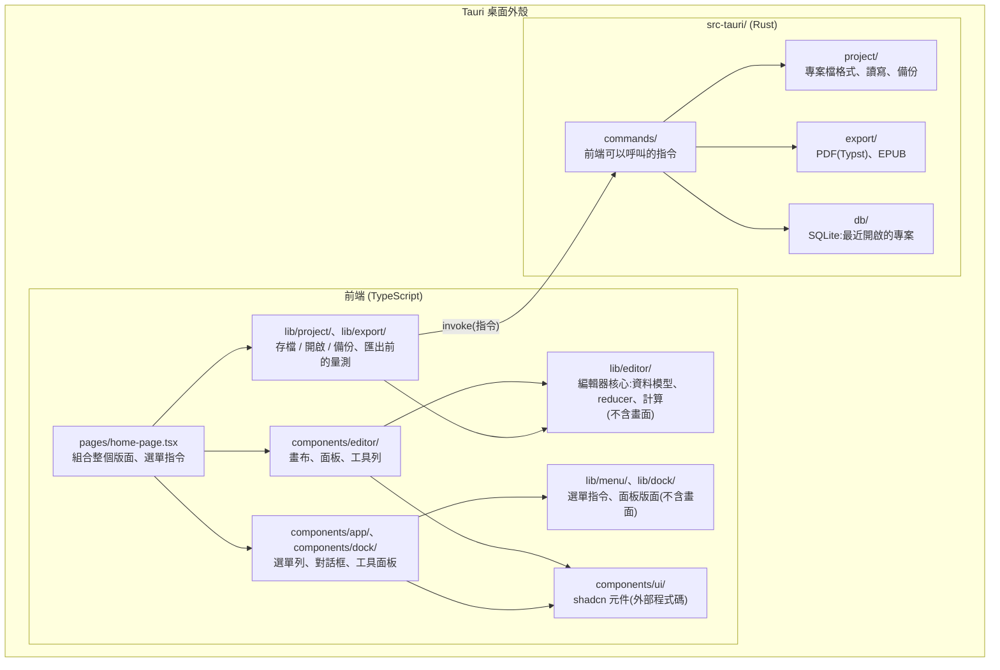
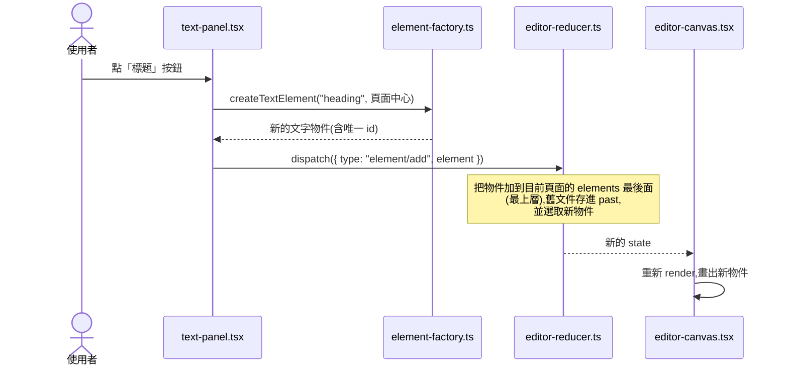
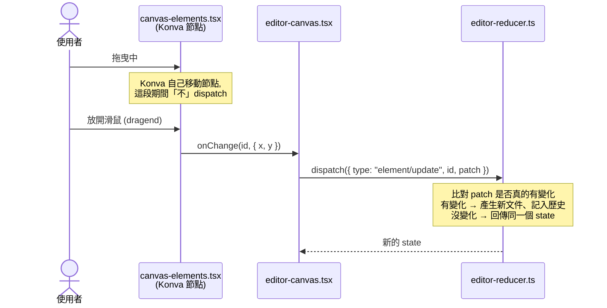

# 02. 架構與資料流程

> 先讀 [01-overview.md](01-overview.md)。

## 一句話說明

**畫面不直接修改資料。** 使用者操作時,畫面送出一個「動作」(action),交給一個純函式 (reducer) 算出新的狀態,React 再依照新狀態重畫畫面。



這種寫法叫做**單向資料流**。只要看懂這個循環,就看懂了這個專案一半的程式碼。

---

## 模組地圖



前端和 Rust 之間**只有一條路**:`lib/project/` 用 `invoke` 呼叫 Rust 的指令(command)。畫面元件不直接呼叫 Rust。

### 各資料夾要不要讀

| 資料夾 | 行數 | 負責什麼 | 要讀嗎 |
|---|---|---|---|
| `src/lib/editor/` | 約 2,200 | **編輯器核心**:資料模型、狀態變化、幾何計算(含圖形頂點、圖形內文字的位置)、驗證、畫布工具。不含任何畫面 | **最優先** |
| `src/components/editor/` | 約 2,700 | 畫布、面板內容(含屬性面板)、上方控制列與底部工具列、頁籤列 | 需要 |
| `src/pages/`、`src/App.tsx`、`src/main.tsx` | 約 200 | 程式進入點、版面組合、選單指令接線 | 需要(很短) |
| `src/lib/project/` | 約 750 | 新增 / 開啟 / 儲存 / 另存、匯入圖片、自動備份、關閉前提示;呼叫 Rust 的地方 | 之後再看(06 會講) |
| `src/lib/menu/`、`src/components/app/`(不含 `app-sidebar.tsx`) | 約 650 | 選單列、快捷鍵、「要儲存變更嗎?」與「要復原嗎?」對話框 | 之後再看 |
| `src/components/dock/`、`src/lib/dock/` | 約 900 | 工具面板:左右停靠、拖曳、分隔條、版面記憶 | 之後再看 |
| `src/lib/export/` | 約 80 | 匯出前用 Konva 量測每段文字的分行 | 之後再看 |
| `src/components/app/app-sidebar.tsx` | 約 200 | 舊的側邊欄,**已不使用** | 跳過 |
| `src/components/ui/` | 約 1,900 | shadcn 產生的通用元件,當作外部套件 | **跳過** |
| `src/**/__tests__/` | 約 1,500 | 測試 | 之後再看 |
| `src-tauri/src/` | 約 4,300 | Rust 後端:專案檔、匯出 PDF / EPUB、SQLite(含 Rust 測試) | 之後再看(06 會講) |

> 前端(不含測試)約 9,500 行,其中 shadcn 元件和舊側邊欄約 2,100 行可以跳過。**先讀懂 `lib/editor/`、`components/editor/` 和 `pages/`(約 5,100 行)**,其他資料夾等用到時再看。
>
> 2026-10-01 型別重構後,`lib/editor/` 與 `components/editor/` 各多了約 500 行(圖形合併成 `shape`、屬性面板、邊框、圖形內文字)。型別的關係圖見 [`docs-website/types.html`](../docs-website/types.html)。

---

## 核心概念 1:`lib/editor/` 為什麼不含畫面

`lib/editor/` 裡的程式碼**只處理資料**,不 import 任何畫面元件、不碰 Konva 畫布。只有兩個檔案使用 React,負責把核心邏輯接到畫面:`editor-context.tsx`(把 reducer 接到 React)和 `use-editor-shortcuts.ts`(監聽鍵盤快捷鍵)。

**好處:**

- **容易測試:** 輸入資料、檢查輸出,不需要開瀏覽器。專案的測試全部集中在這裡。
- **邏輯集中:** 「刪除頁面後要選哪一頁」這種規則只寫在一個地方,不會散落在各個按鈕裡。
- **可以重用:** 存檔(`lib/project/`)和匯出(`lib/export/`)直接使用同一份資料模型,不需要另外轉換。

**原則:** 新增邏輯時,優先放在 `lib/editor/` 並補測試;`components/` 只負責顯示和把使用者操作轉成 action。

---

## 核心概念 2:狀態 (state) 裡有什麼

整個編輯器的狀態定義在 `editor-reducer.ts` 的 `EditorState`:

```
EditorState
├── history                ← 會被「復原/重做」影響
│   ├── past     過去的文件(最多 100 份)
│   ├── present  目前的文件(頁面、物件都在這裡)
│   └── future   復原後可以重做的文件
│
├── activePageId           ← 以下都不會被復原/重做影響
├── selectedId
├── view (zoom、fitRequest)
├── tool、shapeKind        ← 底部工具列目前的工具與圖形
├── assets                 ← 專案裡的圖片清單(會存檔,但不進復原歷史)
└── savedDocument          ← 上次存檔時的文件,用來判斷「有沒有未存檔的修改」
```

`savedDocument` 的用法很簡單:`present` 和 `savedDocument` 是**同一個物件**就代表沒有修改。修改後再復原回存檔時的樣子,兩者又變回同一個物件,視窗標題的 `●` 就自動消失。

另外,**工具面板的版面** (`dockLayout`:哪些面板開著、在哪一側、寬度) 不在 `EditorState` 裡,而是 `home-page.tsx` 自己的 `useState`,因為只有版面需要知道;它也不會被復原,而是存在瀏覽器的 `localStorage`。

**為什麼要分開?** 按 Ctrl+Z 時,使用者期待的是「剛才改的內容回來」,而不是「剛才的縮放比例或選取狀態回來」。所以只有文件內容 (`present`) 進入歷史紀錄。

> 復原/重做的細節在 04 說明。

---

## 核心概念 3:兩個完整的資料流程範例

### 範例 A:從「文字」面板加入標題



### 範例 B:拖曳物件後放開



**為什麼拖曳中不 dispatch?** 每次 dispatch 修改文件都會產生一筆復原紀錄。如果拖曳時每移動一點就 dispatch,拖一次就會產生上百筆紀錄,按 Ctrl+Z 只會退回一點點,畫面也會一直重畫。所以只在**放開時**送出一次。

---

## 核心概念 4:讓編譯器幫你檢查「漏改」

專案刻意用 TypeScript 的型別,讓「新增東西時忘記改某個地方」直接變成**編譯錯誤**,而不是執行時才出 bug。

| 位置 | 檢查什麼 |
|---|---|
| `editor-reducer.ts` 的 `HANDLERS` | 每一種 action 都必須有對應的處理函式 |
| `panels/index.ts` 的 `PANELS` | 每個工具面板都必須有對應的內容 |
| `canvas-elements.tsx` 的 `switch` | 每一種物件類型都必須有繪製方式;`ShapeBody` 的 `switch` 對每一種 geometry(矩形、橢圓、多邊形、星形)也一樣 |
| `editor-canvas.tsx` 的 `TRANSFORMER_OPTIONS` | 每一種物件類型都必須設定縮放控制點 |
| `properties-panel.tsx` 的 `tabsOf` / `GeometrySection` | 每一種物件都必須決定屬性面板有哪些分頁;每一種 geometry 都必須決定有哪些參數 |
| `panel-icons.ts` 的 `PANEL_ICONS` | 每個工具面板都必須有 icon |
| `lib/menu/commands.ts` 的 `CommandHandlers` | 每個選單指令都必須有處理函式(還沒做的用佔位函式) |
| Rust `export/render.rs` 的 `match` | 每一種物件類型都必須能轉成匯出用的資料 |

**例子:** 在 `src/lib/dock/panels.ts` 的 `PANEL_DEFINITIONS` 加一個新面板 `"shapes"`,卻忘了在 `PANELS` 加內容,`npm run build` 就會失敗並指出缺少 `shapes`。

> 所以看到 `satisfies Record<...>`、`{ [T in ...]: ... }`、`const exhaustive: never = ...` 這類寫法時,它們的用途就是這種檢查。

---

## 核心概念 5:state 和 dispatch 分成兩個 Context

`editor-context.tsx` 提供兩個 Context 和三個 hook:

| Hook | 取得什麼 |
|---|---|
| `useEditorState()` | 整個 state |
| `useEditorDispatch()` | `dispatch` 函式 |
| `useActivePage()` | 目前頁面(由 state 算出來) |

**為什麼分開?** React 的 Context 值一改變,所有讀取它的元件都會重新 render。如果某個元件**只需要 dispatch**(例如只負責送出動作的按鈕),它就只讀 dispatch 的 Context,狀態變化時就不會跟著重畫。

---

## Rust 後端(簡介)

前端的 JavaScript 跑在 WebView 裡,不能直接讀寫硬碟。需要碰檔案的工作都交給 Rust:

| 資料夾 | 負責什麼 |
|---|---|
| `commands/` | 前端可以呼叫的指令:專案(新增、開啟、儲存、另存、匯入圖片)、自動備份、匯出 PDF |
| `project/` | 專案檔 `project.magproj` 的格式定義與驗證、安全寫入(先寫暫存檔再取代)、圖片複製、備份檔 |
| `export/` | 把文件轉成匯出用的資料,再產生 PDF(內嵌 Typst)或 EPUB(EPUB 還沒有按鈕) |
| `db/` | SQLite 資料庫 `app.db`,目前記錄最近開啟的專案 |

兩個設計原則(06 詳細說明):

- **前端不傳檔案路徑給 Rust。** 開啟 / 另存 / 匯出的對話框由 Rust 開,前端只說「存檔」,不說「存到哪裡」。
- **檔案格式以 Rust 為準。** 讀檔和存檔時 Rust 都會檢查內容,外部檔案不可信任。

---

## 建議的程式碼閱讀順序

照這個順序打開檔案,一次讀一個,配合 `npm run dev` 操作:

| 順序 | 檔案 | 行數 | 讀的時候注意 |
|---|---|---|---|
| 1 | `src/lib/editor/types.ts` | 約 120 | 文件、頁面、物件長什麼樣子;配合 `docs-website/types.html` 的關係圖看 |
| 2 | `src/lib/editor/editor-reducer.ts` | 約 370 | 所有 action 的清單、`commit` 如何記錄歷史 |
| 3 | `src/lib/editor/editor-context.tsx` | 約 80 | reducer 怎麼接到 React |
| 4 | `src/pages/home-page.tsx` | 約 160 | 版面怎麼組合、`dockLayout` 在哪、選單指令接到哪些函式 |
| 5 | `src/components/editor/panels/text-panel.tsx` | 約 50 | 最簡單的「按按鈕 → dispatch」例子(範例 A) |
| 6 | `src/components/editor/canvas-elements.tsx` | 約 190 | 物件怎麼畫成 Konva 節點、拖曳放開時送出什麼(範例 B) |
| 7 | `src/components/editor/editor-canvas.tsx` | 約 380 | **先略過**捲動和縮放相關的 `useLayoutEffect`,05 再講 |

`home-page.tsx` 裡的 `ProjectProvider`、`useProjectCommands` 屬於存檔流程,第一次讀可以先當作「負責檔案的黑盒子」,06 再打開。

**讀不懂時可以這樣問 Claude:**「解釋 `editor-reducer.ts` 的 `commit` 函式,用具體例子說明 `past` 怎麼變化。」

---

## 自我檢查題

1. 使用者點「標題」按鈕後,依序經過哪些檔案,畫布才出現新文字?
2. 拖曳物件的過程中,為什麼不會一直 dispatch?
3. 按 Ctrl+Z 後,縮放比例會不會跟著變回去?為什麼?
4. 如果在 `PANEL_DEFINITIONS` 新增一個面板,但沒有加對應的內容,會發生什麼事?
5. 對物件送出 `element/update`,但 patch 的值和原本完全一樣,reducer 會怎麼做?有什麼好處?
6. 新增一段「計算物件是否重疊」的邏輯,應該放在哪個資料夾?為什麼?

<details>
<summary>參考答案</summary>

1. `text-panel.tsx`(按鈕)→ `element-factory.ts`(`createTextElement` 建立物件)→ `dispatch` 送到 `editor-reducer.ts`(`element/add` 把物件加入目前頁面並記入歷史)→ `EditorProvider` 提供新 state → `editor-canvas.tsx` 重新 render,由 `canvas-elements.tsx` 畫出文字。
2. 每次修改文件的 dispatch 都會產生一筆復原紀錄。拖曳中一直 dispatch 會產生大量紀錄、畫面不斷重畫,所以只在放開 (dragend) 時送出一次。
3. **不會。** 縮放比例在 `view` 裡,屬於 UI 狀態,不在 `history` 中;復原只影響文件內容 (`present`)。
4. **編譯失敗。** `PANELS` 用 `satisfies Record<PanelId, ComponentType>` 檢查,缺少任何一個面板的內容,`npm run build` 就會報錯。
5. reducer 發現沒有變化,會**回傳同一個 state 物件**。好處:不會產生一筆沒意義的復原紀錄,React 也不會重新 render。
6. `src/lib/editor/`(例如 `geometry.ts`)。這是不含畫面的純邏輯,放在這裡容易寫測試,也方便其他地方重用。

</details>
